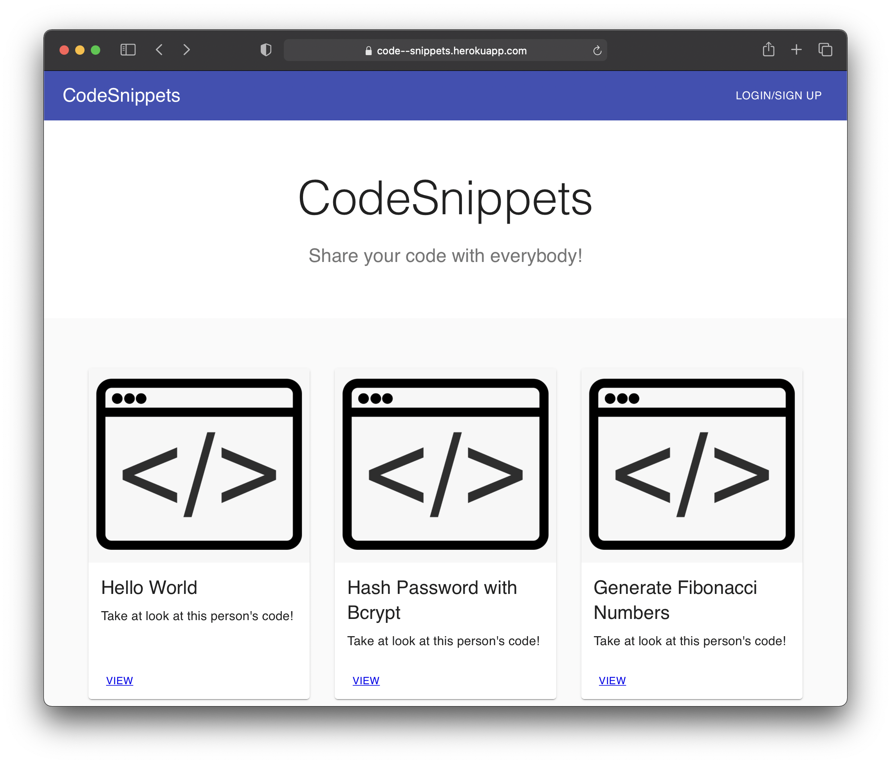

# Code Snippets

- This is an application where users can access code snippets on a variety of topics

- We worked directly with Stripe developers to let users subscribe to our service for premium code snippets

- Made for [Code Chrysalis API Week Hackathon!](https://www.youtube.com/watch?v=2fFEclQv7CI&t=419s)

- Check out the app [here.](https://code--snippets.herokuapp.com/)



### Technologies:
- Front End
  - React
  - React Router
  - Material UI
- Back End
  - Node/Express
  - Stripe API
  - JSON Web Token
  - Knex
  - PostgreSQL
- Deployment
  - Heroku

### Getting Started
1. First clone the repository to your local machine
```
git clone https://github.com/sethwright/glowing-stripe.git
```

2. Install all dependencies
```
npm install && cd client && npm install
```

3. Make sure you have Postgres installed, in a .env file specify your 
- DB_USER
- DB_PW
- DB_NAME
- JWT_SECRET (for authentication)

```
npm start
```
- to run in development mode
```
npm run dev
```

4. This app requires developer keys from Stripe API to utilize the payment features of the app, please refer to the [official Stripe documentation](https://stripe.com/docs/api) for more info. Once you have your keys, they can be placed in your .env file as:
  - PUBLISHABLE_KEY
  - SECRET_KEY
  - and any stripe products you wish to use

### Contributors:

- [Dominick Wynter](https://github.com/tokyodom) 
- [Keizo Hamaguchi](https://github.com/guchiatwork)
- [Seth Wright](https://github.com/sethwright)